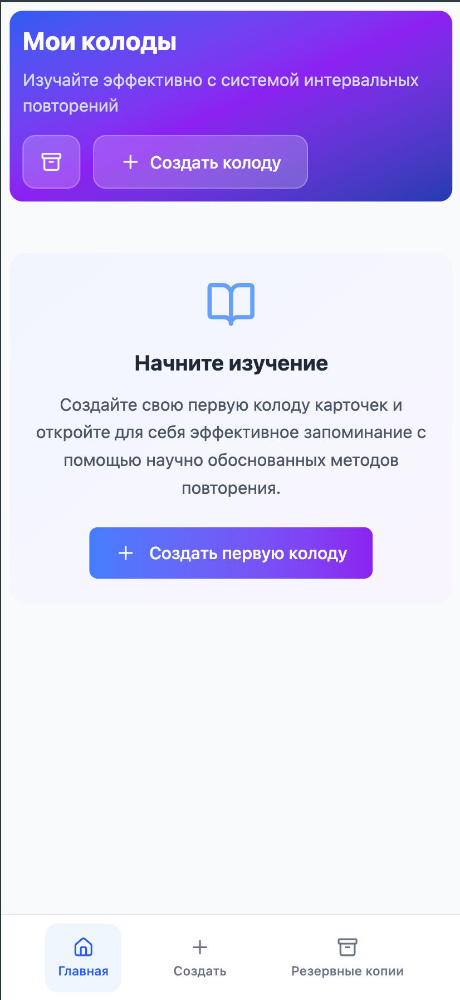

# Mnemoza

  
  
  **Mnemoza** — приложение для изучения с помощью карточек
  
  [🚀 Демо](https://serpres.github.io/mnemoza/) • Работает офлайн • PWA • Алгоритм интервального повторения

## 📱 Скриншоты

  

---

*Современное веб-приложение для изучения с помощью карточек, построенное на React и TypeScript. Работает полностью офлайн, используя IndexedDB для хранения данных.*